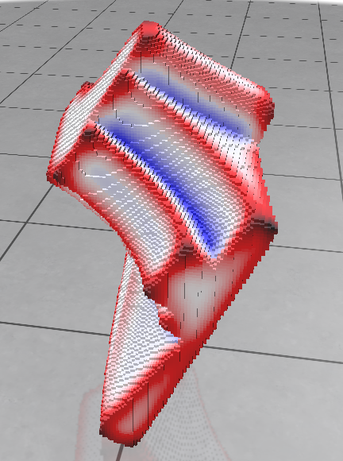

# Varifold approach to 3D curvature approximation on voxelized objects

[//]: # (Describe what the main goal of the project is)

In this project, we implement the varifold approach to 3D curvature approximation described in the following [paper](https://theses.hal.science/tel-01136577/document) :
> Blanche Buet. Approximation de surfaces par des varifolds discrets : représentation, courbure, rectifiabilité. Mathématiques générales [math.GM]. Université Claude Bernard - Lyon I, 2014. Français. NNT : 2014LYO10310 . tel-01136577

**Authors of the code:** [Romain N.](https://www.github.com/romain22222/)

## Building

[//]: # (Describe how to build the project)

```bash
mkdir build
cd build
cmake .. -DCMAKE_BUILD_TYPE=Release
make -j 8
```

It will automatically fetch and install polyscope as a dependency.

## Running

[//]: # (Describe how to run the project)

```bash
./varifoldApproach <filename> <sphere_proximity_radius> <sphere_distribution_type ("fd", "c", "hs")> 
```

If unprovided, the default values are:
- filename: "DGtalObjects/bunny66.vol" (the voxelized object to study)
- sphere_proximity_radius: 10.0 (the radius of the sphere in which we will take the points to compute the curvature)
- sphere_distribution_type: "hs" (the kernel function to use, see below for more information)

## Implemented formula

The computation of the curvature is based on the following formula:

$$
H_{\varepsilon}(x)=-\frac{\delta V * \rho_{\varepsilon}(x)}{\|V\| * \rho_{\varepsilon}(x)} \underset{\varepsilon \rightarrow 0}{\longrightarrow} H(x)
$$

where $V$ is the studied varifold, $\rho_{\varepsilon}$ the kernel function and $H(x)$ the curvature at point $x$.

---

In the case of a point cloud, the formula becomes:

```math
\begin{equation}
H_{\varepsilon}^N(x)=-\frac{\delta V_N * \rho_{\varepsilon}(x)}{\left\|V_N\right\| * \rho_{\varepsilon}(x)}=-\frac{\sum_{j=1}^N m_j \zeta^{\prime}\left(\frac{\left|x_j-x\right|}{\varepsilon}\right) \frac{\Pi_{P_j}\left(x_j-x\right)}{\left|x_j-x\right|}}{\sum_{j=1}^N m_j \varepsilon \zeta\left(\frac{\left|x_j-x\right|}{\varepsilon}\right)} .
\end{equation}
```

where $V_N$ is the varifold associated with the point cloud, $m_j$ the mass of the point $x_j$, $\zeta$ the kernel function and $\Pi_{P_j}$ the orthogonal projection on the tangent plane $P_j$ at point $x_j$.

For the voxelized objects, I chose to focus on a 3d point cloud implementation of the formula, easier to implement and to understand, and very versatile in terms of choice of usable data.

## Implementation

The logic is as follows:

First, we choose what will be the information contained in the varifold. We can choose between the following options, all shown when the program is run:

- Trivial normal of the surfel and position of the face centroid (Method::TrivialNormalFaceCentroid) (The simplest approach)
- Vertex normal (or dual face normal) and vertex position (Method::DualNormalVertexPosition)
- Corrected face normal and face centroid (Method::CorrectedNormalFaceCentroid)

Then, we choose the kernel function. 2nd argument of the program stands for the radius of the sphere in which we will take the points to compute the curvature. 3rd argument of the program gives the kernel function to use. We can choose between the following options:
- "fd" for the Flat Disc kernel (all the points in the sphere have the same weight)
- "c" for the Cone kernel (the weight of the points decreases with the distance to the center of the sphere)
- "hs" for the 4d Sphere kernel (the weight of the points decreases with the square of the distance to the center of the sphere)

The program will then compute the curvature at each point of the object by applying the formula above. The result is then displayed with polyscope.

We generate 2 types of quantities for each kind of method: the vectors of curvatures and the heat map of the curvatures.

The legend of the heat map is the following:
- Red: high positive curvature
- Blue: high negative curvature
- White: no curvature

## Results

Here are some results obtained with the program:

### Bunny


*Trivial normal of the surfel and position of the face centroid*

---


*Vertex normal (or dual face normal) and vertex position*

---


*Corrected face normal and face centroid*

### Fandisk


*Trivial normal of the surfel and position of the face centroid*

---


*Vertex normal (or dual face normal) and vertex position*

---


*Corrected face normal and face centroid*


## Next steps

- Use CNC to quickly compute the meaningful points of interest
- Implement the possibility of using an implicit function to create the object
- Implement quantification of the error between the computed curvature and the real curvature (on computed objects with known curvature)
